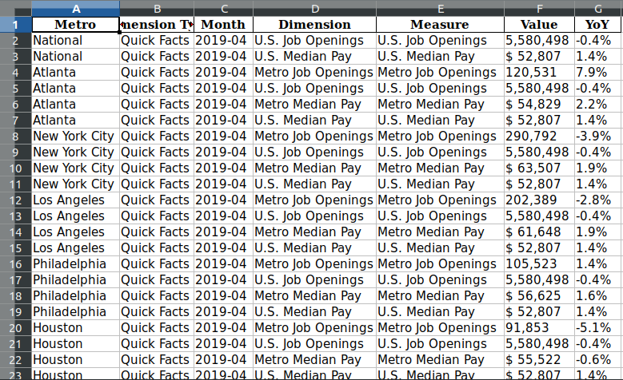

```{r setup, include=FALSE}
knitr::opts_chunk$set(echo = TRUE)
```

# Introduction {#intro}

This article aims to meet the first LBB (Learn by Building) assignment from Algoritma, i.e. [Programming for Data Science](https://algorit.ma/course/programming-data-science/). In this article, you could expect to find the following sections:

* Introduction of the article can be found in [Introduction](#intro)
* More detailed explanation of the data is in [Dataset](#daset)
* How to prepare the data can be read in [Preparation](#prep)
* Steps to clean the data is in [Data Cleansing](#daclen)
* Steps to transform the data is found in [Data Transformation](#datran)
* Data visualization can be seen in [Plotting](#plot)
* Discussion about the plotting is described in [Inference](#infer)
* Conclusions of the article can be read in [Conclusions](#concl)

Here, I intend to employ data from Glassdoor regarding job market in the US. You can find the web page [here](https://www.glassdoor.com/research/job-market-report-historical/). Also, Glassdoor has its visualizations on the data as shown [here](https://www.glassdoor.com/research/job-market-report/).

I publish this article on [RPubs](), but you can find the codes on [GitHub](https://github.com/utomoreza/P4DS_LBB). Feel free to use or clone it.

# Dataset {#daset}

The data are compiled monthly by Glassdoor from 2016. Each monthly datum is in .xlsx extension file. The columns of each of it consist of:
+ Metro
Some metropolitan areas in the US. The National value indicates data from national area.
+ Dimension Type
Type of data we want, e.g. Quick Facts (facts about median salary and job openings), Industry (sectors of the jobs), and so on.
+ Month
The time format of the data.
+ Dimension
This is the derivative of Dimension Type column. All options here depend on Dimension Type.
+ Measure
This column determines what method of measurement used.
+ Value
Depending on Dimension Type and Dimension columns you chose, this Value column contains either median salary or number of job openings. The value with '$' (dollar) sign indicates salary in USD.
+ YoY:
Year over year in percent. For more information about how to understand and calculate YoY, you can read this [article](https://www.sisense.com/blog/calculate-year-year-growth/) I found really helpful.

Below is a quick look of the data in spreadsheet application.



For more information regarding the data, you can read its methodology written exclusively by Glassdoor [here](https://www.glassdoor.com/research/app/uploads/sites/2/2019/04/Methodology-Glassdoor-Job-Market-Report-2-2.pdf).

# Preparation {#prep}

We have identified the data, so now we're going to prepare the data. Although the total data started from 2016, in this article, I only use monthly data from 2018 and 2019; there are 24 .xlsx files. It will be time consuming and exhausting if we download each file one by one manually. Therefore, here we're going to scrape the Glassdoor web page and download all necessary files automatically.

## Load Necessary Packages

First thing first, we must load all libraries needed.

```{r, warning=FALSE, message=FALSE}
library('readxl')
library('rvest')
library('lubridate')
library('zoo')
library('openxlsx')
library('tidyverse')
```

## Download and Save the Data

In the code chunk below, we're going to define a function called `get_xls_file_from_html()` used to scrape Glassdoor web page and download all .xlsx files there and save them in local directory with appropriate file names.

```{r}
get_xls_file_from_html <- function() {
    dataurl <- "https://www.glassdoor.com/research/job-market-report-historical/"
    page <- read_html(dataurl)
    
    excels1 <- grep("\\.xlsx", html_nodes(page, "a"), value = T)
    excels2 <- gsub(".*href=\"", "", excels1)
    excels <- gsub("xlsx.*", "xlsx", excels2)
    excels_path <- as.character(sapply(excels,
                                       FUN = substr,
                                       start = 64,
                                       stop = max(sapply(excels, nchar))))
    excels_path1_31 <- gsub(".*data-", "", excels_path[1:31])
    excels_path[32] <- "2017-05.xlsx"
    excels_path[33] <- "2017-04.xlsx"
    excels_path[34] <- "2017-03.xlsx"
    excels_path[35] <- "2017-02.xlsx"
    excels_path[36] <- "2017-01.xlsx"
    excels_path[37] <- "2016-12.xlsx"
    excels_path[38] <- "2016-11.xlsx"
    excels_path[39] <- "2016-10.xlsx"
    
    excels_path <- c(excels_path1_31, excels_path[32:39])
    
    destination <- paste("./datasets/", excels_path, sep = "")
    
    #file extraction
    mapply(function(x, y) download.file(x, y, mode="wb"), x = excels, y = destination)
}
```

The code chunk below is used to check whether we've had the xlsx files already in our local directory. If they do not exist, `get_xls_file_from_html()` will be excuted.

```{r, warning=FALSE, results='hide'}
load("filespath.RData")

if (!file.exists(filespath)) {
        get_xls_file_from_html
    }

# check_if_fileexist <- function(){
#     if (!file.exists(filespath)) {
#         get_xls_file_from_html
#     }
# }

# mapply(check_if_fileexist)
```

## Load the Data into RStudio

In order to load each monthly xlsx file into RStudio, we define a function `select_files_to_read()` and save it in local directory as `select_files_to_read.R` as shown in below chunk. Since I have save the function earlier, I have to make the function listing codes in comment lines.

```{r}
# select_files_to_read <- function(month = "Dec", year = 2019) {
#     load("filespath.RData")
#     
#     if (month == "Dec") {
#         month_num = 1
#     } else if (month == "Nov") {
#         month_num = 2
#     } else if (month == "Oct") {
#         month_num = 3
#     } else if (month == "Sep") {
#         month_num = 4
#     } else if (month == "Aug") {
#         month_num = 5
#     } else if (month == "Jul") {
#         month_num = 6
#     } else if (month == "Jun") {
#         month_num = 7
#     } else if (month == "May") {
#         month_num = 8
#     } else if (month == "Apr") {
#         month_num = 9
#     } else if (month == "Mar") {
#         month_num = 10
#     } else if (month == "Feb") {
#         month_num = 11
#     } else {
#         month_num = 12
#     }
#     
#     files <- list("2019" = filespath[1:12],
#                   "2018" = filespath[13:24],
#                   "2017" = filespath[25:36],
#                   "2016" = filespath[37:39])
#     
#     if (year == 2016) {
#         yearOrder <- 4
#         if (month == "Dec" | month == "Nov" | month == "Oct") {
#             xlsname <<- paste0(month, year)
#             year_char <- as.character(year)
#             tempfilename <<- as.data.frame(read_xlsx(files[[yearOrder]][month_num]))
#         } else {
#             stop("Year 2016 have Dec, Nov and Oct files only.")
#         }
#     } else {
#         xlsname <<- paste0(month, year)
#         if (year == 2019) {
#             yearOrder <- 1
#         } else if (year == 2018) {
#             yearOrder <- 2
#         } else {
#             yearOrder <- 3
#         }
#         tempfilename <<- as.data.frame(read_xlsx(files[[yearOrder]][month_num]))
#     }
# }
# 
# dump("select_files_to_read", file = "select_files_to_read.R")
```

And now call the `select_files_to_read()` then insert it into another function `loadMultipleFiles()`. The latter works to iterate `select_files_to_read()` function in specified number of years fully.

```{r}
source("select_files_to_read.R")
# select_files_to_read("Dec", 2019)

# myexport <- function(...) {
#     arg.list <- list(...)
#     names <- all.names(match.call())[-1]
#     for (i in seq_along(names)) assign(names[i],arg.list[[i]],.GlobalEnv)
# }

loadMultipleFiles <- function(nmonth = c("Dec"), nyear = c(2019)) {
    files_list1 <- list()
    year <- 1:length(nyear)
    month <- 1:length(nmonth)
    totalIterate <<- length(nmonth) * length(nyear)

    for (i in year) {
        if (length(year) == 1) {
            for (j in month) {
            select_files_to_read(nmonth[j], nyear)
            files_list1[[j]] <- tempfilename
            names(files_list1)[j] <- xlsname
            }
            break
        }
        for (j in month) {
            # browser()
            select_files_to_read(nmonth[j], nyear[i])
            files_list1[[j]] <- tempfilename
            names(files_list1)[j] <- xlsname
            # browser()
        }
        # browser()
    }
    files_list <<- files_list1
}
```

After we've defined both functions above, now we're going to use them by setting their arguments in order to load all monthly files in 2018 and 2019. The outputs of below chunk are dataframes of each monthly file.

```{r}
loadMultipleFiles(nmonth = c("Dec","Nov","Oct","Sep","Aug","Jul","Jun","May","Apr","Mar","Feb","Jan"))

for (k in 1:totalIterate) {
    # browser()
    assign(names(files_list)[k], as.data.frame(files_list[[k]]))
    # browser()
}
rm(files_list, tempfilename)
```

## Combine months DFs into 1 DF (year)

After we've got all monthly dataframe, we should combine them in a single dataframe of year.

```{r}
# totalDF <- ls(pattern = "2019")

year2019 <- rbind(Apr2019, Aug2019, Dec2019, Feb2019, Jan2019, Jul2019, Jun2019, Mar2019, May2019, Nov2019, Oct2019, Sep2019)

# write.xlsx(year2019, "./datasets/year2019.xlsx")
```

Yeah! Finally, we've got our prepared data! Let's move on to clean the data.

# Data Cleansing {#daclen}

First of all, we need to see the data structure.
```{r}
str(year2019)
```

Based on the information above, we need to change data type a number of columns. However, before we begin do that, for the sake of convenience, we need to fix two columns' name:
- "Dimension Type" to "Dimention_Type"
- "Month" to "Date"

```{r}
colnames(year2019) <- c("Metro", "Dimension_Type", "Date", "Dimension", "Measure", "Value", "YoY")
```

Then, referring to the data structure above, all columns' data type are in character data type initially. By using our judgement, we're sure the columns of `Date`, `Value`, and `YoY` should be in date, numeric, and numeric data type respectively. But, for the rest of columns, we have to make sure whether they should be left as they are or be changed to factor data type.

* `Metro` column

```{r}
unique(year2019$Metro)
```

For `Metro` column, there are 16 unique observations only. Therefore, it will be more easier to handle if we change this column to factor data type.

```{r}
year2019$Metro <- as.factor(year2019$Metro)
```

* `Dimension_Type` column

```{r}
unique(year2019$Dimension_Type)
```

For `Dimension_Type` column, there are 5 unique observations only so that no wonder if we need to change its data type to factor immediately.

```{r}
year2019$Dimension_Type <- as.factor(year2019$Dimension_Type)
```

* `Dimension` column

```{r}
unique(year2019$Dimension)
```

For `Dimension_Type` column, there are 135 unique observations. That's a big number! So, we just leave its data type as it is.

* `Measure` column

```{r}
unique(year2019$Measure)
```

For `Dimension_Type` column, there are 6 unique observations only. So, let's change its data type to factor.

```{r}
year2019$Measure <- as.factor(year2019$Measure)
```

* `Date` column

While we're sure `Date` column should be in date data type, we still need to arrange its data type. Before we begin, let's take a quick look at the head and tail of such column.

```{r}
head(year2019$Date)
tail(year2019$Date)
```

We saw that the format of the column is in year-month, without date. However, since the total number of rows of the data is 50015, we are not sure yet whether all observations of such column are written in the same format. What if there are some row written in year-month-date or even other format?

To answer this, let's see the column deeper by using `unique()` function.

```{r}
unique(year2019$Date)
```

Bingo! As I told you, there are some with year-month-date format. Therefore, we've got two formats in one column. And since this is annoying, we have to unify all observations to one format only. So, we have two format options: year-month or year-month-date.

If we were to choose the first option, we will lose other observations' date information so that this option is not affordable. Then, if we were to choose another option, the consequence is that we have to coerce the year-month format oservations to year-month-date format. Simply, we could insert 'dummy' date, i.e. 01, at the end of each year-month observation. Therefore, I think it will be more comfortable if we select the second choice.

```{r}
isString7Chars <- function(input) {
    if (nchar(input) == 7) {
        output <- paste0(input, '-01')
    } else {
        output <- input
    }
}

year2019$Date <- as.character(sapply(year2019$Date, isString7Chars)) %>% 
    ymd()
```

* `Value` column

We stated earlier that `Value` should be in numeric data type. But, before we start to change its data type, let's take a look of it using `head()`, `tail()`, and `unique()` functions.

```{r}
head(year2019$Value)
tail(year2019$Value)
unique(year2019$Value)
```

We can see that in general there are two formats: those with `$` sign and those without one. So, before we jump to data type change, we have to accomplish those two. In order to assign `Value` column to be in numeric data type, we have to remove the `$` sign so that we can use the following codes.

```{r}
year2019$Value <- sapply(year2019$Value, function(x) as.numeric(gsub("[,$]", "", x)))
```

* `YoY` column

For this column, we can perform the steps as `Value` column in order to check the data format.

```{r}
head(year2019$YoY)
tail(year2019$YoY)
unique(year2019$YoY)
```

We saw that in general there are 4 formats:
- Those with `%` and `-` signs
- Those with `%` sign only
- Those with `-` sign only
- Those without any sign

The `%` sign indicates percentage (1/100), whereas the `-` means negative number. Though we're not 100% sure, we could imply that those without the `%` sign also mean percentage, but perhaps the data entry clerk forgot to put the sign. And for those without `-` sign, we could interpret them as positive number.

Using the above idea, we can change the column data type to numeric and format it in 1/100 format (not in `%` symbol).

```{r}
year2019$YoY <- sapply(year2019$YoY, function(x) as.numeric(gsub("[%]", "", x)))/100
```

Well done! We have adjusted all columns' format. So, now let's check it the data out to convince ourself that we did well.

```{r}
head(year2019)
```

Alright. All columns have been in appropriate data type. For the next step, let's move on to the next section below.

# Data Transformation {#datran}

As our data is too complicated to infer directly from one table, it will be more convenient if we split it into several subtables: salary for each job title, salary for each sector, salary for each company size, job openings for each sector, job openings for each company size, quick facts, and time series.

## Create a Table "Salary for each job title"

This subtable consists of median salary and YoY for each job title in a given specific metro area and on a specific date. To create it, we extract some columns from our main data. We're only interested in `Dimension_Type` of `"Job Title"`.

```{r}
Salary_Jobs <- year2019 %>% 
    filter(Dimension_Type == "Job Title") %>% 
    select(Metro, Date, Dimension, Value, YoY)
colnames(Salary_Jobs) <- c("Area","Date","Job_Title", "Salary", "YoY")
Salary_Jobs
```

Great! We've got what we desired. Now, check if there is any NA in our new table.

```{r}
Salary_Jobs %>% 
    is.na() %>% 
    colSums()
```

Wow! It's really clean! We have zero number of NA. As we have new table, it's gonna be better if we assign `Job Title` column data type to factor because job titles are just an iteration for each area and date.

```{r}
Salary_Jobs$Job_Title <- as.factor(Salary_Jobs$Job_Title)
levels(Salary_Jobs$Job_Title)
Salary_Jobs
```

## Create a Table "Salary for each sector"

This subtable consists of median salary for each sector in a given specific metro area and on a specific date. To create it, we extract some columns from our main data. We're only interested in `Dimension_Type` of `"Industry"` and `Measure` of `"Median Base Pay"`.

```{r}
Salary_Sectors <- year2019 %>% 
    filter(Dimension_Type == "Industry" & Measure == "Median Base Pay") %>% 
    select(Metro, Date, Dimension, Value)
colnames(Salary_Sectors) <- c("Area","Date","Sector", "Salary")
Salary_Sectors
```

Next, we're going to check its NA value.

```{r}
Salary_Sectors %>% 
    is.na() %>% 
    colSums()
```

And wow again! No NA value found. As we have new table, it's gonna be better if we assign `Sector` column data type to factor because sectors are just an iteration for each area and date.

```{r}
Salary_Sectors$Sector <- as.factor(Salary_Sectors$Sector)
levels(Salary_Sectors$Sector)
Salary_Sectors
```

## Create a Table "Salary for each company size"

This subtable consists of median salary for each company size in a given specific metro area and on a specific date. To create it, we extract some columns from our main data. We're only interested in `Dimension_Type` of `"Company Size"` and `Measure` of `"Median Base Pay"`.

```{r}
Salary_CompanySize <- year2019 %>% 
    filter(Dimension_Type == "Company Size" & Measure == "Median Base Pay") %>% 
    select(Metro, Date, Dimension, Value)
colnames(Salary_CompanySize) <- c("Area","Date","Company_Size", "Salary")
Salary_CompanySize
```

Next, we're going to check its NA value.

```{r}
Salary_CompanySize %>% 
    is.na() %>% 
    colSums()
```

And wow again! No NA value found. As we have new table, it's gonna be better if we assign `Company_Size` column data type to factor because company sizes are just an iteration for each area and date.

```{r}
Salary_CompanySize$Company_Size <- as.factor(Salary_CompanySize$Company_Size)
levels(Salary_CompanySize$Company_Size)
Salary_CompanySize
```

## Create a Table "Job openings for each sector"

This subtable consists of number of job openings and its YoY for each sector in a given specific metro area and on a specific date. To create it, we extract some columns from our main data. We're only interested in `Dimension_Type` of `"Industry"` and `Measure` of `"Job Openings"`.

```{r}
JobOpening_Sectors <- year2019 %>% 
    filter(Dimension_Type == "Industry" & Measure == "Job Openings") %>% 
    select(Metro, Date, Dimension, Value, YoY)
colnames(JobOpening_Sectors) <- c("Area","Date","Sector", "Openings", "YoY")
JobOpening_Sectors
```

And now, we check its NA value.

```{r}
JobOpening_Sectors %>% 
    is.na() %>% 
    colSums()
```

Cool! No NA found. As we have new table, it's gonna be better if we assign `Sector` column data type to factor because sectors are just an iteration for each area and date.

```{r}
JobOpening_Sectors$Sector <- as.factor(JobOpening_Sectors$Sector)
levels(JobOpening_Sectors$Sector)
JobOpening_Sectors
```

## Create a Table "Job openings for each company size"

This subtable consists of number of job openings and its YoY for each company size in a given specific metro area and on a specific date. To create it, we extract some columns from our main data. We're only interested in `Dimension_Type` of `"Company Size"` and `Measure` of `"Job Openings"`.

```{r}
JobOpening_CompanySize <- year2019 %>% 
    filter(Dimension_Type == "Company Size" & Measure == "Job Openings") %>% 
    select(Metro, Date, Dimension, Value, YoY)
colnames(JobOpening_CompanySize) <- c("Area","Date","Company_Size", "Openings", "YoY")
JobOpening_CompanySize
```

Let's check its NA value.

```{r}
JobOpening_CompanySize %>% 
    is.na() %>% 
    colSums()
```
Crap! There are 88 NAs. First, let's check such column with 88 NAs.

```{r}
unique(JobOpening_CompanySize$Company_Size)
```

Can you see there are `Other` and `NA` there? Since for the table of salary for each company size we just use 6 factor levels (i.e. "<51", "1001-5000", "201-500", "5000+", "501-1000", and "51-200"), for ease, we also use 6 factor levels in this job opening company size table. So, let's drop the "Other" and NA values and convert the column to factor data type.

```{r}
JobOpening_CompanySize <- JobOpening_CompanySize[JobOpening_CompanySize$Company_Size != "Other",] %>% drop_na()
JobOpening_CompanySize$Company_Size <- as.factor(JobOpening_CompanySize$Company_Size)
```

Now, let's recheck the NA and "Other" values.

```{r}
JobOpening_CompanySize %>% 
    is.na() %>% 
    colSums()
levels(JobOpening_CompanySize$Company_Size)
```

Great! All clean, without any NA and "Other" value anymore.

## Create a Table "Quick facts"

This subtable contains Median Pay and Job Openings data from Glassdoor and US BLS (Bureau of Labor Statistics) for each area.

```{r}
QuickFacts <- year2019 %>% 
    filter(Dimension_Type == "Quick Facts") %>% 
    select(Metro, Date, Dimension, Value, YoY) %>% 
    pivot_wider(names_from = Dimension, values_from = c(Value, YoY))
QuickFacts <- as.data.frame(cbind(QuickFacts$Metro,
                                  QuickFacts$Date,
                                  QuickFacts$`Value_Metro Median Pay`,
                                  QuickFacts$`Value_U.S. Median Pay`,
                                  QuickFacts$`Value_Metro Job Openings`,
                                  QuickFacts$`Value_U.S. Job Openings`,
                                  QuickFacts$`YoY_Metro Median Pay`,
                                  QuickFacts$`YoY_U.S. Median Pay`,
                                  QuickFacts$`YoY_Metro Job Openings`,
                                  QuickFacts$`YoY_U.S. Job Openings`))
colnames(QuickFacts) <- c("Area","Date","Metro_Median_Pay", "US_Median_Pay",
                            "Metro_JobOpenings","US_JobOpenings","YoY_Metro_Median_Pay",
                            "YoY_US_Median_Pay","YoY_Metro_JobOpenings","YoY_US_JobOpenings")
```

## Create a Table "Time Series"

This subtable consists of 

Let's make sure that `YoY` column when `Dimension_Type == "Timeseries"` is completely NA.

```{r}
year2019 %>% 
    filter(Dimension_Type == "Timeseries") %>% 
    nrow()
year2019 %>% 
    filter(Dimension_Type == "Timeseries") %>% 
    is.na() %>% 
    colSums()
```

```{r}
# TimeSeries <- year2019 %>% 
#     filter(Dimension_Type == "Timeseries") %>% 
#     select(Metro, Year_Month, Dimension, as.numeric(Value)) %>% 
#     pivot_wider(names_from = Dimension, values_from = Value)
#     select(Metro, Year_Month, )
```

# Plotting {#plot}

# Inference {#infer}

# Conclusions {#concl}
