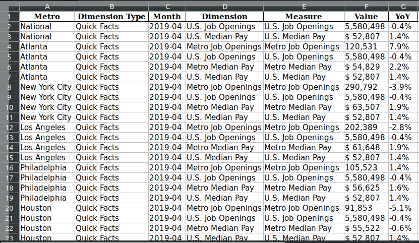

```{r setup, include=FALSE}
knitr::opts_chunk$set(echo = TRUE)
```

# Introduction {#intro}

## Background

This article aims to meet the first LBB (Learn by Building) assignment from Algoritma, i.e. [Programming for Data Science](https://algorit.ma/course/programming-data-science/). In this article, you could expect to find the following sections:

* Introduction of the article can be found in [Introduction](#intro)
* More detailed explanation of the data is in [Dataset](#daset)
* How to prepare the data can be read in [Preparation](#prep)
* Steps to clean the data is in [Data Cleansing](#daclen)
* Steps to transform the data is found in [Data Transformation](#datran)
* Discussion about answering the pre-defined questions is described in [Analysis](#analys)
* Conclusions of the article can be read in [Conclusions](#concl)

Here, I intend to employ data from Glassdoor regarding job market in the US. You can find the web page [here](https://www.glassdoor.com/research/job-market-report-historical/). Also, Glassdoor has its visualizations on the data as shown [here](https://www.glassdoor.com/research/job-market-report/).

I publish this article on [RPubs](), but you can find the codes on [GitHub](https://github.com/utomoreza/P4DS_LBB). Feel free to use or clone it.

## Research Questions

By arranging this article, I'm going to answer several questions as follows:

1. What is the job title paid the most in each area in every given year?
2. Which top 5 sectors do pay salary the most in Boston every year?
3. Is it true that a company with more than 5000 employees in San Fransisco pays its employees' salary higher than a startup (a company with employees less than 200) in NYC? Show the data in every year!
4. What is the trend of Data Scientist job role's salary and need in each area and in the entire US?
5. Does Physician still become the highest paid job role nationally?

# Dataset {#daset}

The data are compiled monthly by Glassdoor from 2016. Each monthly datum is in .xlsx extension file. The columns of each of it consist of:
+ Metro
Some metropolitan areas in the US. The National value indicates data from national area.
+ Dimension Type
Type of data we want, e.g. Quick Facts (facts about median salary and job openings), Industry (sectors of the jobs), and so on.
+ Month
The time format of the data.
+ Dimension
This is the derivative of Dimension Type column. All options here depend on Dimension Type.
+ Measure
This column determines what method of measurement used.
+ Value
Depending on Dimension Type and Dimension columns you chose, this Value column contains either median salary or number of job openings. The value with '$' (dollar) sign indicates salary in USD.
+ YoY:
Year over year in percent. For more information about how to understand and calculate YoY, you can read this [article](https://www.sisense.com/blog/calculate-year-year-growth/) I found really helpful. However, in this article, I won't highlight this YoY feature.

Below is a quick look of the data in spreadsheet application.



For more information regarding the data, you can read its methodology written exclusively by Glassdoor [here](https://www.glassdoor.com/research/app/uploads/sites/2/2019/04/Methodology-Glassdoor-Job-Market-Report-2-2.pdf).

# Preparation {#prep}

We have identified the data, so now we're going to prepare the data. Although the total data started from 2016, in this article, I only use monthly data from 2018 and 2019; there are 24 .xlsx files. It will be time consuming and exhausting if we download each file one by one manually. Therefore, here we're going to scrape the Glassdoor web page and download all necessary files automatically.

## Load Necessary Packages

First thing first, we must load all libraries needed.

```{r, warning=FALSE, message=FALSE}
library('readxl')
library('rvest')
library('lubridate')
library('zoo')
library('openxlsx')
library('tidyverse')
# library('kableExtra')
```

## Download and Save the Data

In the code chunk below, we're going to define a function called `get_xls_file_from_html()` used to scrape Glassdoor web page and download all .xlsx files there and save them in local directory with appropriate file names.

```{r}
get_xls_file_from_html <- function() {
     dataurl <- "https://www.glassdoor.com/research/job-market-report-historical/"
     page <- read_html(dataurl)
     
     excels1 <- grep("\\.xlsx", html_nodes(page, "a"), value = T)
     excels2 <- gsub(".*href=\"", "", excels1)
     excels <- gsub("xlsx.*", "xlsx", excels2)
     excels_path <- as.character(sapply(excels,
                                        FUN = substr,
                                        start = 64,
                                        stop = max(sapply(excels, nchar))))
     excels_path1_31 <- gsub(".*data-", "", excels_path[1:31])
     excels_path[32] <- "2017-05.xlsx"
     excels_path[33] <- "2017-04.xlsx"
     excels_path[34] <- "2017-03.xlsx"
     excels_path[35] <- "2017-02.xlsx"
     excels_path[36] <- "2017-01.xlsx"
     excels_path[37] <- "2016-12.xlsx"
     excels_path[38] <- "2016-11.xlsx"
     excels_path[39] <- "2016-10.xlsx"
     
     excels_path <- c(excels_path1_31, excels_path[32:39])
     
     destination <- paste("./datasets/", excels_path, sep = "")
     
     #file extraction
     mapply(function(x, y) download.file(x, y, mode="wb"), x = excels, y = destination)
}
```

The code chunk below is used to check whether we've had the xlsx files already in our local directory. If they do not exist, `get_xls_file_from_html()` will be excuted.

```{r, warning=FALSE, results='hide'}
load("filespath.RData")

# checkIfFilesExist <- function(filespath){
#      if (!file.exists(filespath)) {
#           get_xls_file_from_html()
#      }
# }

# check_if_fileexist <- function(){
#     if (!file.exists(filespath)) {
#         get_xls_file_from_html
#     }
# }

# mapply(check_if_fileexist)
```

## Load the Data into RStudio

In order to load each monthly xlsx file into RStudio, we define a function `select_files_to_read()` and save it in local directory as `select_files_to_read.R` as shown in below chunk. Since I have save the function earlier, I have to make the function listing codes in comment lines.

```{r}
# select_files_to_read <- function(month = "Dec", year = 2019) {
#     load("filespath.RData")
#     
#     if (month == "Dec") {
#         month_num = 1
#     } else if (month == "Nov") {
#         month_num = 2
#     } else if (month == "Oct") {
#         month_num = 3
#     } else if (month == "Sep") {
#         month_num = 4
#     } else if (month == "Aug") {
#         month_num = 5
#     } else if (month == "Jul") {
#         month_num = 6
#     } else if (month == "Jun") {
#         month_num = 7
#     } else if (month == "May") {
#         month_num = 8
#     } else if (month == "Apr") {
#         month_num = 9
#     } else if (month == "Mar") {
#         month_num = 10
#     } else if (month == "Feb") {
#         month_num = 11
#     } else {
#         month_num = 12
#     }
#     
#     files <- list("2019" = filespath[1:12],
#                   "2018" = filespath[13:24],
#                   "2017" = filespath[25:36],
#                   "2016" = filespath[37:39])
#     
#     if (year == 2016) {
#         yearOrder <- 4
#         if (month == "Dec" | month == "Nov" | month == "Oct") {
#             xlsname <<- paste0(month, year)
#             year_char <- as.character(year)
#             tempfilename <<- as.data.frame(read_xlsx(files[[yearOrder]][month_num]))
#         } else {
#             stop("Year 2016 have Dec, Nov and Oct files only.")
#         }
#     } else {
#         xlsname <<- paste0(month, year)
#         if (year == 2019) {
#             yearOrder <- 1
#         } else if (year == 2018) {
#             yearOrder <- 2
#         } else {
#             yearOrder <- 3
#         }
#         tempfilename <<- as.data.frame(read_xlsx(files[[yearOrder]][month_num]))
#     }
# }
# 
# dump("select_files_to_read", file = "select_files_to_read.R")
```

And now call the `select_files_to_read()` then insert it into another function `loadMultipleFiles()`. The latter works to iterate `select_files_to_read()` function in specified number of years fully.

```{r}
source("select_files_to_read.R")
# select_files_to_read("Dec", 2019)

# myexport <- function(...) {
#     arg.list <- list(...)
#     names <- all.names(match.call())[-1]
#     for (i in seq_along(names)) assign(names[i],arg.list[[i]],.GlobalEnv)
# }

loadMultipleFiles <- function(nmonth = c("Dec"), nyear = c(2019)) {
     files_list1 <- list()
     year <- 1:length(nyear)
     month <- 1:length(nmonth)
     totalIterate <<- length(nmonth) * length(nyear)
     
     for (i in year) {
          if (length(year) == 1) {
               for (j in month) {
                    select_files_to_read(nmonth[j], nyear)
                    files_list1[[j]] <- tempfilename
                    names(files_list1)[j] <- xlsname
               }
               break
          }
          for (j in month) {
               # browser()
               select_files_to_read(nmonth[j], nyear[i])
               files_list1[[j]] <- tempfilename
               names(files_list1)[j] <- xlsname
               # browser()
          }
          # browser()
     }
     files_list <<- files_list1
}
```

After we've defined both functions above, now we're going to use them by setting their arguments in order to load all monthly files in 2018 and 2019. The outputs of below chunk are dataframes of each monthly file.

```{r}
loadMultipleFiles(
  nmonth = c("Dec","Nov","Oct","Sep","Aug","Jul","Jun","May","Apr","Mar","Feb","Jan"),
  nyear = c(2018))

for (k in 1:totalIterate) {
     # browser()
     assign(names(files_list)[k], as.data.frame(files_list[[k]]))
     # browser()
}

loadMultipleFiles(
  nmonth = c("Dec","Nov","Oct","Sep","Aug","Jul","Jun","May","Apr","Mar","Feb","Jan"),
  nyear = c(2019))

for (k in 1:totalIterate) {
     # browser()
     assign(names(files_list)[k], as.data.frame(files_list[[k]]))
     # browser()
}
# rm(files_list, tempfilename)
```

## Combine months DFs into 1 DF (year)

After we've got all monthly dataframes, we should combine them in a single dataframe of year.

```{r}
# totalDF <- ls(pattern = "2019")

year2019 <- rbind(Apr2019, Aug2019, Dec2019, Feb2019, Jan2019, Jul2019, Jun2019, Mar2019, May2019, Nov2019, Oct2019, Sep2019)

year2018 <- rbind(Apr2018, Aug2018, Dec2018, Feb2018, Jan2018, Jul2018, Jun2018, Mar2018, May2018, Nov2018, Oct2018, Sep2018)

year20182019 <- rbind(year2018, year2019)

# if you want, you can save the year dataframe as xls file in local directory
# write.xlsx(year2019, "./datasets/year2019.xlsx")
# write.xlsx(year2018, "./datasets/year2018.xlsx")
# write.xlsx(year20182019, "./datasets/year2018-2019.xlsx")

# for ease of use and saving more memory, we need to remove all unnecessary objects
temp_objects <- ls()
rm(list = temp_objects[-c(11,19,28,35)])
rm(temp_objects)
```

Yeah! Finally, we've got our prepared file! Let's move on to clean it.

# Data Cleansing {#daclen}

First of all, since the file used is big enough, it is recommended to open it in any Spreadsheet application in advance to obtain and explore a quick insight regarding the data.

After viewing the file in Spreadsheet application more detail as shown in the picture in [Introduction](#intro), firstly, we focus on `Dimension Type` column as it explains different information as follows:

1. Company Size

This value has the following Dimensions:
  
  + <51 employees
  + 51-200 employees
  + 201-500 employees
  + 501-1000 employees
  + 1001-5000 employees
  + +5000 employees
  + Other: we should highlight this!
  + Empty value: we should highlight this!
  
This column also has the following Measures:

  + Job Openings (with format `<numbers>` only in `Value` column)
  + Median Base Pay (with format either `<numbers>.0` or `<numbers>` in `Value` column)
  
2. Industry

This value has a number of list of sectors. I'm not going to write it down here. And, this value has the following Measures:

  + Job Openings (with format `<numbers>` only in `Value` column)
  + Median Base Pay (with format either `<numbers>.0` or `<numbers>` in `Value` column)

3. Job Title

This value has a number of list of job titles. I'm not going to write it down here. And, this value has one Measure only, i.e. Median Base Pay (with format either `$ <numbers>,<numbers>` or `$<numbers>,<numbers>` in `Value` column).

4. Quick Facts

This value's Dimension and Measures are perfectly equal which are the followings:

  + Job Openings (with format `<numbers>,<numbers>` in `Value` column)
  + Labor Force Size (with format `<numbers>,<numbers>,<numbers>` in `Value` column)
  + Metro Job Openings (with format `<numbers>,<numbers>` in `Value` column)
  + Metro Median Pay (with format either `$ <numbers>,<numbers>` or `$<numbers>,<numbers>` in `Value` column)
  + Total Employment (with format `<number>,<numbers>,<numbers>` in `Value` column)
  + US Job Openings (with format `<number>,<numbers>,<numbers>` in `Value` column)
  + US Median Pay (with format `$ <numbers>,<numbers>` in `Value` column)
  + Unemployment Rate (with format `<number>.<number>%` in `Value` column)

5. Timeseries

This value's Dimension and Measures are perfectly equal which are the followings:

  + Job Openings (with format either `<numbers>.<numbers>` or `<numbers>` in `Value` column)
  + Median Base Pay (with format either `<numbers>.<numbers>` or `<numbers>` in `Value` column)

Particulary for Labor Force Size, Total Employment, and Unemployment Rate in Quick Facts, I don't need them as their data are too limited. I will remove those later in the next section.

After we saw the data in Excel-like app already, we're going to back to R to manipulate the data. First, let's see the data structure.

```{r}
str(year20182019)
```

Based on the information above, we need to change data type a number of columns. However, before we begin do that, for the sake of convenience, we need to fix two columns' name:
- "Dimension Type" to "Dimention_Type"
- "Month" to "Date"

```{r}
colnames(year20182019) <- c("Metro", "Dimension_Type", "Date", "Dimension", "Measure", "Value", "YoY")
```

Then, referring to the data structure above, all columns' data type are in character data type initially. By using our judgement, we're sure the columns of `Date`, `Value`, and `YoY` should be in date, numeric, and numeric data type respectively. But, for the rest of columns, we have to make sure whether they should be left as they are or be changed to factor data type.

## Drop NA Value

As a starter, let's check whether NA exists.

```{r}
year20182019 %>% is.na() %>% colSums()
```

We can see that NA exist in `Dimension`, `Value`, and `YoY` columns. Let's see each of column with NA values.

```{r}
year20182019[is.na(year20182019$Dimension),]
```

From the dataframe above, it can be seen that the 88 NAs occur on `Dimension_Type == "Company Size"` and `Measure == "Job Openings"` only.

```{r}
year20182019[is.na(year20182019$Value),]
```

It can be seen from dataframe above that the 297 NA values in `Value` column only happen in `Dimension_Type == "Timeseries"`, `Dimension == "Job Openings`, and `Dimension == "Job Openings`.

```{r}
year20182019[is.na(year20182019$YoY),]
```

From dataframe above, it can be seen that there are lots of NAs in `YoY` column. However, since we're not interested in YoY in this article, it's not a problem if we completely drop this column. Then, we clear all NAs in the other two columns.

```{r}
DF <- year20182019[-c(length(year20182019))]
DF <- drop_na(DF)
head(DF)
is.na(DF) %>% colSums()
```

In addition, as I pointed earlier, I won't use `Dimension == "Labor Force Size"`, `Dimension == "Total Employment"`, and `Dimension == "Unemployment Rate"`. So, let's drop them down.

```{r}
DF <- DF[DF$Dimension != "Labor Force Size" & 
           DF$Dimension != "Total Employment" &
           DF$Dimension != "Unemployment Rate",]

head(DF)
is.na(DF) %>% colSums()
```

Excellent! All data clean! Then, now let's move on to set the data type of each column.

* `Metro` column

```{r}
unique(DF$Metro)
```

For `Metro` column, there are 16 unique observations only. However, if you see it more closely, there are some areas with the same meaning bu in slight different typing. Therefore, it will be more easier to handle if we tackle with this problem and change this column to factor data type.

```{r}
DF$Metro <- as.factor(sapply(as.character(DF$Metro), switch, 
                           "National" = "National",
                           "Atlanta" = "Atlanta", 
                           "New York City" = "New York City", 
                           "Los Angeles" = "Los Angeles", 
                           "Philadelphia" = "Philadelphia",
                           "Houston" = "Houston", 
                           "Seattle" = "Seattle", 
                           "San Francisco" = "San Francisco", 
                           "Chicago" = "Chicago",
                           "Boston" = "Boston", 
                           "Washington DC" = "Washington DC",
                           "U.S." = "National", 
                           "New-York-City" = "New York City",
                           "Los-Angeles" = "Los Angeles", 
                           "San-Francisco" = "San Francisco",
                           "Washington-DC" = "Washington DC"))

levels(DF$Metro)
```

Great! We've solved the problem and changed the data type of `Metro` column.

* `Dimension_Type` column

```{r}
unique(DF$Dimension_Type)
```

For `Dimension_Type` column, there are 5 unique observations only so that no wonder if we need to change its data type to factor immediately.

```{r}
DF$Dimension_Type <- as.factor(DF$Dimension_Type)
```

* `Dimension` column

```{r}
unique(DF$Dimension) #%>% 
     # kable() %>%
     # kable_styling() %>%
     # scroll_box(width = "500px", height = "200px")
length(unique(DF$Dimension))
```

For `Dimension` column, there 135 unique observations. That's a big number! So, we just leave its data type as it is.

* `Measure` column

```{r}
unique(DF$Measure)
```

For `Measure` column, there are 6 unique observations only. So, let's change its data type to factor.

```{r}
DF$Measure <- as.factor(DF$Measure)
```

* `Date` column

While we're sure `Date` column should be in date data type, we still need to arrange its data type. Before we begin, let's take a quick look at the head and tail of such column.

```{r}
head(DF$Date)
tail(DF$Date)
```

We saw that the format of the column is in year-month, without date. However, since the total number of rows of the data is 50015, we are not sure yet whether all observations of such column are written in the same format. What if there are some row written in year-month-date or even other format?

To answer this, let's see the column deeper by using `unique()` function.

```{r}
# unique(DF$Date) #%>% 
     # kable() %>%
     # kable_styling() %>%
     # scroll_box(width = "500px", height = "200px")
```

Bingo! As I told you, there are some with year-month-date format. Therefore, we've got two formats in one column. And since this is annoying, we have to unify all observations to one format only. So, we have two format options: year-month or year-month-date.

If we were to choose the first option, we will lose other observations' date information so that this option is not affordable. Then, if we were to choose another option, the consequence is that we have to coerce the year-month format oservations to year-month-date format. Simply, we could insert 'dummy' date, i.e. 01, at the end of each year-month observation. Therefore, I think it will be more comfortable if we select the second choice.

```{r}
isString7Chars <- function(input) {
     if (nchar(input) == 7) {
          output <- paste0(input, '-01')
     } else {
          output <- input
     }
}

DF$Date <- as.character(sapply(DF$Date, isString7Chars)) %>% 
     ymd()
```

* `Value` column

We stated earlier that `Value` should be in numeric data type. Furthermore, it was mentioned in the beginning of [Data Cleansing](#daclen) that there is a number of `Value` column formats (after removing some rows). They are as follows:

* `<numbers>`
* `<numbers>.0`
* `<numbers>,<numbers>`
* `$ <numbers>,<numbers>`
* `$<numbers>,<numbers>`
* `<number>,<numbers>,<numbers>`

Before we jump to data type change, we have to handle those formats to make them in uniform format. We can use the following codes.

```{r}
DropDollar <- function(input){
     output <- gsub("\\$", "", input)
     output <- gsub(" ", "", output)
     output <- gsub(",", "", output)
     return(output)
}

DF$Value <- round(as.numeric(sapply(DF$Value, DropDollar)))
```

Well done! We have adjusted all columns' format. So, now let's check it the data out to convince ourself that we did well.

```{r}
head(DF)
```

Alright. All columns have been in appropriate data type. For the next step, let's move on to the next section below.

# Data Transformation {#datran}

As our data is too complicated to infer directly from one table, it will be more convenient if we split it into several subtables: salary for each job title, salary for each sector, salary for each company size, job openings for each sector, job openings for each company size, quick facts, and time series.

## Create a Table "Salary for each job title"

This subtable consists of median salary for each job title in a given specific metro area and on a specific date. To create it, we extract some columns from our main data. We're only interested in `Dimension_Type` of `"Job Title"`.

```{r}
Salary_Jobs <- DF %>%
     filter(Dimension_Type == "Job Title") %>%
     select(Metro, Date, Dimension, Value)
colnames(Salary_Jobs) <- c("Area","Date","Job_Title", "Salary")
head(Salary_Jobs)
```

Great! We've got what we desired. As we have new table, it's gonna be better if we assign `Job Title` column data type to factor because job titles are just an iteration for each area and date.

```{r}
Salary_Jobs$Job_Title <- as.factor(Salary_Jobs$Job_Title)
levels(Salary_Jobs$Job_Title)
```

## Create a Table "Salary for each sector"

This subtable consists of median salary for each sector in a given specific metro area and on a specific date. To create it, we extract some columns from our main data. We're only interested in `Dimension_Type` of `"Industry"` and `Measure` of `"Median Base Pay"`.

```{r}
Salary_Sectors <- DF %>%
     filter(Dimension_Type == "Industry" & Measure == "Median Base Pay") %>%
     select(Metro, Date, Dimension, Value)
colnames(Salary_Sectors) <- c("Area","Date","Sector", "Salary")
head(Salary_Sectors)
```

As we have new table, it's gonna be better if we assign `Sector` column data type to factor because sectors are just an iteration for each area and date.

```{r}
Salary_Sectors$Sector <- as.factor(Salary_Sectors$Sector)
levels(Salary_Sectors$Sector)
```

## Create a Table "Salary for each company size"

This subtable consists of median salary for each company size in a given specific metro area and on a specific date. To create it, we extract some columns from our main data. We're only interested in `Dimension_Type` of `"Company Size"` and `Measure` of `"Median Base Pay"`.

```{r}
Salary_CompanySize <- DF %>%
     filter(Dimension_Type == "Company Size" & Measure == "Median Base Pay") %>%
     select(Metro, Date, Dimension, Value)
colnames(Salary_CompanySize) <- c("Area","Date","Company_Size", "Salary")
head(Salary_CompanySize)
```

Next, we're going to assign `Company_Size` column data type to factor because company sizes are just an iteration for each area and date.

```{r}
Salary_CompanySize$Company_Size <- as.factor(Salary_CompanySize$Company_Size)
levels(Salary_CompanySize$Company_Size)
```

## Create a Table "Job openings for each sector"

This subtable consists of number of job openings and its YoY for each sector in a given specific metro area and on a specific date. To create it, we extract some columns from our main data. We're only interested in `Dimension_Type` of `"Industry"` and `Measure` of `"Job Openings"`.

```{r}
JobOpening_Sectors <- DF %>%
     filter(Dimension_Type == "Industry" & Measure == "Job Openings") %>%
     select(Metro, Date, Dimension, Value)
colnames(JobOpening_Sectors) <- c("Area","Date","Sector", "Openings")
head(JobOpening_Sectors)
```

And now, we assign `Sector` column data type to factor because sectors are just an iteration for each area and date.

```{r}
JobOpening_Sectors$Sector <- as.factor(JobOpening_Sectors$Sector)
levels(JobOpening_Sectors$Sector)
```

## Create a Table "Job openings for each company size"

This subtable consists of number of job openings and its YoY for each company size in a given specific metro area and on a specific date. To create it, we extract some columns from our main data. We're only interested in `Dimension_Type` of `"Company Size"` and `Measure` of `"Job Openings"`.

```{r}
JobOpening_CompanySize <- DF %>%
     filter(Dimension_Type == "Company Size" & Measure == "Job Openings") %>%
     select(Metro, Date, Dimension, Value)
colnames(JobOpening_CompanySize) <- c("Area","Date","Company_Size", "Openings")
head(JobOpening_CompanySize)
```

We remember that as mentioned at the beginning of [Data Cleansing](#daclen) Section, in addition to its normal values, Company Size also has abnormal values, namely "Other" and NA. We tackled the NAs already in the previous section, but not yet for "Other". Therefore, firstly, let's check if "Other" still exists in our data.

```{r}
unique(JobOpening_CompanySize$Company_Size)
```

Okay. It's still there. Let's remove it and convert the column to factor data type.

```{r}
JobOpening_CompanySize <- JobOpening_CompanySize[JobOpening_CompanySize$Company_Size != "Other",]
JobOpening_CompanySize$Company_Size <- as.factor(JobOpening_CompanySize$Company_Size)
```

## Create a Table "Quick facts"

This subtable contains Median Pay and Job Openings data from Glassdoor and US [BLS](https://www.bls.gov/) (Bureau of Labor Statistics) for each area.

```{r}
QuickFacts <- DF %>%
     filter(Dimension_Type == "Quick Facts") %>%
     select(Metro, Date, Dimension, Value) %>%
     pivot_wider(names_from = Dimension, values_from = Value)
colnames(QuickFacts) <- c("Area","Date","US_Median_Pay","Metro_Median_Pay",
                          "JobOpenings","US_JobOpenings","Metro_JobOpenings")
head(QuickFacts)
```

NAs identified! This can happen because after we've made the table wider, not each member of Dimension has similar Date attribute. That's why some have certain dates, whereas others have other dates. For this case, I'm going to split up the table based on the columns after `Date` column and remove the NAs subsequently. So, we will have 5 smaller tables.

* Quick Facts for US Median Pay

```{r}
QuickFacts_USMedianPay <- QuickFacts[!is.na(QuickFacts$US_Median_Pay),1:3]
is.na(QuickFacts_USMedianPay) %>% colSums()
head(QuickFacts_USMedianPay)
```

* Quick Facts for Metro Median Pay

```{r}
QuickFacts_MetroMedianPay <- QuickFacts[!is.na(QuickFacts$Metro_Median_Pay),c(1,2,4)]
is.na(QuickFacts_MetroMedianPay) %>% colSums()
head(QuickFacts_MetroMedianPay)
```

* Quick Facts for Job Openings

```{r}
QuickFacts_JobOpenings <- QuickFacts[!is.na(QuickFacts$JobOpenings),c(1,2,5)]
is.na(QuickFacts_JobOpenings) %>% colSums()
head(QuickFacts_JobOpenings)
```

* Quick Facts for US Job Openings

```{r}
QuickFacts_USJobOpenings <- QuickFacts[!is.na(QuickFacts$US_JobOpenings),c(1,2,6)]
is.na(QuickFacts_USJobOpenings) %>% colSums()
head(QuickFacts_USJobOpenings)
```

* Quick Facts for Metro Job Openings

```{r}
QuickFacts_MetroJobOpenings <- QuickFacts[!is.na(QuickFacts$Metro_JobOpenings),c(1,2,7)]
is.na(QuickFacts_MetroJobOpenings) %>% colSums()
head(QuickFacts_MetroJobOpenings)
```

## Create a Table "Time Series"

This subtable comes from `Timeseries` column in the main dataframe. It's going to have data of median salary and job openings in certain time interval. It will be more convenient if we split it up into two smaller dataframe.

* Time Series for Job Openings

```{r}
TimeSeries_JobOpenings <- DF %>%
  filter(Dimension_Type == "Timeseries" & Dimension == "Job Openings") %>%
  select(Metro, Date, Value) %>%
  group_by(Metro, Date) %>%
  summarise(Job_Openings = mean(Value)) %>%
  ungroup()
head(TimeSeries_JobOpenings)

# Also check if NA exist
is.na(TimeSeries_JobOpenings) %>% colSums()
```

Cool! Nothing wrong happens. Let's move on to Time Series for Median Salary.

* Time Series for Median Salary

```{r}
TimeSeries_Salary <- DF %>%
  filter(Dimension_Type == "Timeseries" & Dimension == "Metro Median Base Pay") %>%
  select(Metro, Date, Value) %>%
  group_by(Metro, Date) %>%
  summarise(Salary = mean(Value)) %>%
  ungroup()
head(TimeSeries_Salary)
```

Though we don't see any NA value, it's not a bad idea if we check the dataframe.

```{r}
TimeSeries_Salary %>%
  is.na() %>%
  colSums()
```

Great! No NA at all!

And now, we have all transformed the data and are ready for the next section to analyze the data.

# Analysis {#analys}

Finally, we arrive in this section. Here, we're going to answer all questions defined in [Introduction](#intro). So, let's get it started.

1. What is the job title paid the most in each area in every given year?

In order to answer this question, we need `Salary_Jobs` dataframe. Afterwards, we filter the data by its each year and each area. Next, for all rows filtered, calculate mean of salary for each job title in 12 months for each year, and then find the max salary from all averaged salary of job titles. The codes to perform these steps can be find below. Firstly, I create a function.

```{r}
Q1_func <- function(year) {
  Q1 <- Salary_Jobs[year(Salary_Jobs$Date) == year,]
  
  maxPay_eachArea <- vector()
  maxTitle_eachArea <- vector()
  
  areas <- levels(Q1$Area)
  for (area in areas) {
    temp <- Q1[Q1$Area == area,]
    
    
    avg <- vector()
    titles <- vector()
  
    temp$Job_Title <-  droplevels(temp$Job_Title)
    jobs <- levels(temp$Job_Title)
    for (job in jobs) {
      avg_buffer <- round(mean(temp[temp$Job_Title == job, "Salary"]))
      avg <- c(avg, avg_buffer)
      titles <- c(titles, job)
    }
    
    max_pay <- max(avg)
    max_title <- titles[which.max(avg)]
    
    maxPay_eachArea <- c(maxPay_eachArea, max_pay)
    maxTitle_eachArea <- c(maxTitle_eachArea, max_title)
    
    Q1_ans <- as.data.frame(cbind(Area = areas,
                              Job_Title = maxTitle_eachArea, 
                              Salary = maxPay_eachArea))
    return(Q1_ans)
  }
}
```

By using above function, we can find highest paid job for each area every year.

  + The highest paid job in 2018
  
```{r}
Q1_ans2018 <- Q1_func(2018)
Q1_ans2018 <- Q1_ans2018[order(Q1_ans2018$Salary, decreasing = T),]
Q1_ans2018[c(1,2,3,4,5,7,8,9,10,11),]
```

  + The highest paid job in 2019

```{r}
Q1_ans2019 <- Q1_func(2019)
Q1_ans2019 <- Q1_ans2019[order(Q1_ans2019$Salary, decreasing = T),]
Q1_ans2019[c(1,2,3,4,5,7,8,9,10,11),]
```

Looking at two tables above, Attorney and Pharmacist mostly lead all jobs' salary.

2. Which top 5 sectors do pay salary the most in Boston every year?

In order to answer this question, we need `Salary_Sectors` dataframe. Afterwards, we filter the data by its each year and Boston area. Next, for all rows filtered, calculate mean of salary for each job title in 12 months for each year, and then find the max salary from all averaged salary of job titles. The codes to perform these steps can be find below. Firstly, I create a function.

```{r}
Q2_func <- function(year) {
  Q2 <- Salary_Sectors[year(Salary_Sectors$Date) == year & Salary_Sectors$Area == "Boston",]

  pay <- vector()
  Q2$Sector <-  droplevels(Q2$Sector)
  sectors <- levels(Q2$Sector)
  for (sector in sectors) {
    pay_buffer <- round(mean(Q2[Q2$Sector == sector, "Salary"]))
    pay <- c(pay, pay_buffer)
    # titles <- c(titles, job)
  }
  year <- rep(year, length(sectors))
  return(data.frame(Year = year, Sector = sectors, Salary = pay))
}

Q2_ans2018 <- Q2_func(2018)
Q2_ans2018 <- Q2_ans2018[order(Q2_ans2018$Salary, decreasing = T),]
Q2_ans2019 <- Q2_func(2019)
Q2_ans2019 <- Q2_ans2019[order(Q2_ans2019$Salary, decreasing = T),]

Q2_ans <- rbind(head(Q2_ans2018, 5), head(Q2_ans2019, 5))
Q2_ans
```

From above table, we can see that top 4 sectors in 2018 and 2019 are the same. Those sectors stay remained in big four for 2 years. The second highest sector, Biotech and Pharmaceuticals, strengthens the relationship between the first and the second questions that Pharmacists, as one of highest paid job, perhaps also work at Biotech and Pharmaceuticals sector which is also one of sectors with highest salary.

3. Is it true that a company with more than 5000 employees in San Fransisco pays its employees' salary higher than a startup (a company with employees less than 200) in NYC? Show the data in every year!


4. What is the trend of Data Scientist job role's salary and need in each area and in the entire US?


5. Does Physician still become the highest paid job role nationally?

# Conclusions {#concl}
